<div align="center">

# FAIML RL project — group 64

**Reinforcement Learning for sim-to-real robot control** — policy gradient methods on
*Hopper* (part 1) and the *PandaPush* sim-to-sim task with domain randomization (part 2).


<table>
<tr>
<td align="center">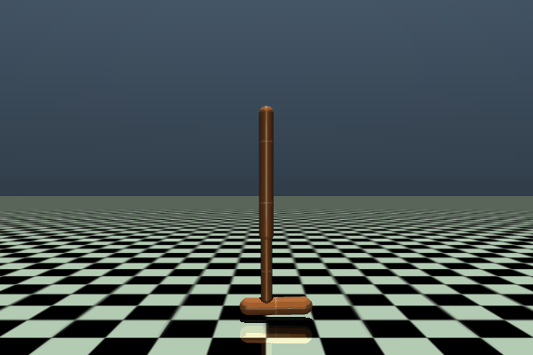<br><sub><b>Part 1</b> — Hopper · Actor-Critic</sub></td>
<td align="center">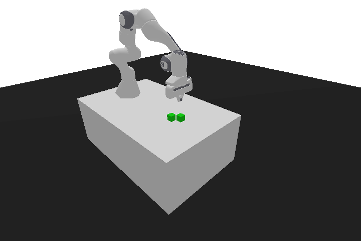<br><sub><b>Part 2</b> — PandaPush · SAC (100% success)</sub></td>
</tr>
</table>

</div>

---

Our code for the RL project: Hopper control in part 1, and the sim-to-real push task
(panda-gym) with domain randomization in part 2.

## Setup

```
pip install -r requirements.txt
```

Quick check that things work: `python part1/test_random_policy.py`.

Part 2 uses a local copy of panda-gym, install it from the folder:
`pip install -e part2/panda-gym`.

## What's where

- `part1/` — REINFORCE, REINFORCE + baseline and actor-critic on Hopper.
  Training in `train.py` and `train_ac.py`, testing in `test.py`, rollout-to-GIF in `render_gif.py`.
- `part2/` — PPO and SAC on the push task, with the UDR/ADR randomization living in
  `rand_wrapper.py`. Training in `train_sb3.py`, eval in `eval_sb3.py`, rollout-to-GIF in `render_gif.py`.
- `report_cvpr/` — LaTeX source (CVPR template) and the compiled `main.pdf`.

## Results at a glance

**Part 1 — Hopper** (best 100-episode training return, mean over 3 seeds)

| Algorithm | Best avg-100 return | Note |
|---|---|---|
| REINFORCE (b = 0) | 1006 | unbiased but high-variance Monte Carlo returns |
| REINFORCE (b = 20) | 1807 | constant baseline gives only limited variance reduction |
| Actor-Critic | **1938** | strongest performer; high inter-seed variance and a late collapse |

The Actor-Critic collapse (advantage variance → 0 under normalization) and REINFORCE's
variance are exactly what motivate the trust-region / entropy methods of part 2 (PPO, SAC).

**Part 2 — PandaPush, SAC** (target domain, 3 seeds)

| Train → Test | Success rate | Mean return |
|---|---|---|
| source → target — none *(lower bound)* | 0.98 | −0.63 |
| target → target — none *(upper bound)* | 1.00 | −0.44 |
| source → target — UDR | 1.00 | −0.51 |
| source → target — ADR | 0.99 | −0.56 |

SAC already transfers well with no randomization (the mass gap is small); UDR/ADR mostly
improve the *return* (efficiency), closing the gap toward the upper bound.

## Trainings, logs and model weights

We ran a lot of trainings, so the heavy stuff stays outside the repo.

> **Note on the Drive folder:** it holds the **part 2** material only — the SAC / UDR / ADR
> models, their `VecNormalize` states, TensorBoard logs and the hyperparameter-sweep outputs.
> The **part 1** Hopper policies (`.pth`) are small and live directly in `part1/`.

| Resource | Link |
|---|---|
| Drive — part 2 SAC/UDR/ADR models, TB logs, sweep figures | https://drive.google.com/drive/folders/1E1y1AwZ2oIPeDL7Y4RPE5VPml3dOItwC |
| W&B — Part 1 final runs (REINFORCE / Actor-Critic, 3 seeds — the report numbers) | https://wandb.ai/s355100-politecnico-di-torino/hopper_REINFORCE_Actor_Critic |
| W&B — Part 1 earlier runs (first 3-seed batch, 70k episodes) | https://wandb.ai/s355100-politecnico-di-torino/faiml-group64-part1 |
| W&B — Part 2 (SAC + UDR/ADR, PandaPush) | https://wandb.ai/s355100-politecnico-di-torino/faiml-group64-part2 |
| W&B — PPO baseline (step-budget scaling) | https://wandb.ai/s355100-politecnico-di-torino/faiml-group64-ppo |
| W&B — SAC hyperparameter sweep (Bayesian) | https://wandb.ai/s355100-politecnico-di-torino/faiml-group64-sweep |
| W&B — PPO hyperparameter sweep | https://wandb.ai/s355100-politecnico-di-torino/ppo_sweep_3 |

The small Hopper policies (`.pth`) are already in `part1/`. The final SAC models are in
`part2/models/` — each one needs its `vecnormalize.pkl` next to it, otherwise evaluation
gives wrong numbers.

<details>
<summary><b>Direct links to the individual W&B runs</b></summary>

**Part 1 — Hopper, final runs** (`hopper_REINFORCE_Actor_Critic` — these back the report numbers)

| Algorithm | Seed 42 | Seed 67 | Seed 128 |
|---|---|---|---|
| Actor-Critic | [i545aipy](https://wandb.ai/s355100-politecnico-di-torino/hopper_REINFORCE_Actor_Critic/runs/i545aipy) | [636v9kg2](https://wandb.ai/s355100-politecnico-di-torino/hopper_REINFORCE_Actor_Critic/runs/636v9kg2) | [lomqneko](https://wandb.ai/s355100-politecnico-di-torino/hopper_REINFORCE_Actor_Critic/runs/lomqneko) |
| REINFORCE (no baseline) | [o13ot15g](https://wandb.ai/s355100-politecnico-di-torino/hopper_REINFORCE_Actor_Critic/runs/o13ot15g) | [cyjiwtga](https://wandb.ai/s355100-politecnico-di-torino/hopper_REINFORCE_Actor_Critic/runs/cyjiwtga) | [qglsc8ct](https://wandb.ai/s355100-politecnico-di-torino/hopper_REINFORCE_Actor_Critic/runs/qglsc8ct) |
| REINFORCE (baseline b=20) | [u0dpdlff](https://wandb.ai/s355100-politecnico-di-torino/hopper_REINFORCE_Actor_Critic/runs/u0dpdlff) | [sz67y12d](https://wandb.ai/s355100-politecnico-di-torino/hopper_REINFORCE_Actor_Critic/runs/sz67y12d) | [1wfqf7vy](https://wandb.ai/s355100-politecnico-di-torino/hopper_REINFORCE_Actor_Critic/runs/1wfqf7vy) |

**Part 2 — PandaPush SAC** (`faiml-group64-part2`)

| Configuration | Seed 0 | Seed 1 | Seed 2 |
|---|---|---|---|
| SAC source → (none) | [vdmjqipe](https://wandb.ai/s355100-politecnico-di-torino/faiml-group64-part2/runs/vdmjqipe) | [d4hyux9z](https://wandb.ai/s355100-politecnico-di-torino/faiml-group64-part2/runs/d4hyux9z) | [1e2eg1la](https://wandb.ai/s355100-politecnico-di-torino/faiml-group64-part2/runs/1e2eg1la) |
| SAC target → (none) *(upper bound)* | [q9fcvhpm](https://wandb.ai/s355100-politecnico-di-torino/faiml-group64-part2/runs/q9fcvhpm) | [lxswswst](https://wandb.ai/s355100-politecnico-di-torino/faiml-group64-part2/runs/lxswswst) | [nrftfkpl](https://wandb.ai/s355100-politecnico-di-torino/faiml-group64-part2/runs/nrftfkpl) |
| SAC source → UDR | [iuy3hbmi](https://wandb.ai/s355100-politecnico-di-torino/faiml-group64-part2/runs/iuy3hbmi) | [7kriq3io](https://wandb.ai/s355100-politecnico-di-torino/faiml-group64-part2/runs/7kriq3io) | [kk6ghj2g](https://wandb.ai/s355100-politecnico-di-torino/faiml-group64-part2/runs/kk6ghj2g) |
| SAC source → ADR | [6iu2ni9e](https://wandb.ai/s355100-politecnico-di-torino/faiml-group64-part2/runs/6iu2ni9e) | [egrw9a56](https://wandb.ai/s355100-politecnico-di-torino/faiml-group64-part2/runs/egrw9a56) | [4tmaeg79](https://wandb.ai/s355100-politecnico-di-torino/faiml-group64-part2/runs/4tmaeg79) |

</details>

## Results gallery

Full set of plots produced during the project (beyond the few that fit in the 5-page report).
Interactive versions of the curves and sweeps are on the linked W&B projects.

<details open>
<summary><b>Part 1 — Hopper (REINFORCE &amp; Actor-Critic)</b></summary>
<br>
<table>
<tr>
<td align="center">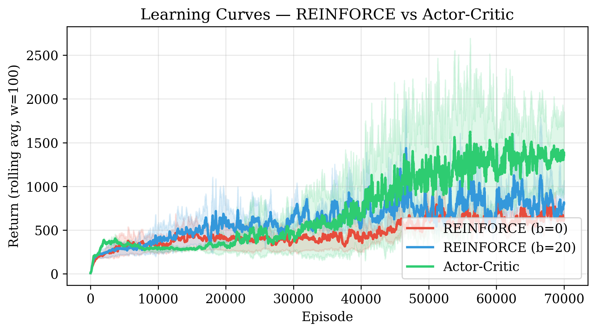<br><sub>Learning curves — return (100-ep rolling avg) ± std, 3 seeds</sub></td>
<td align="center">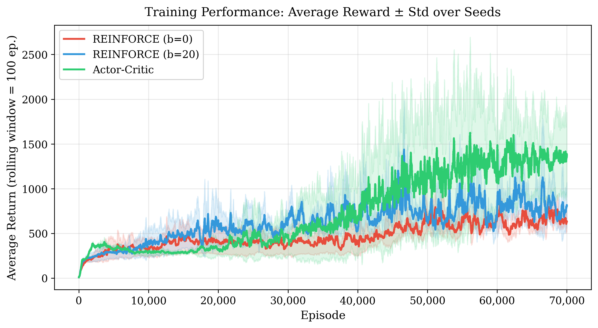<br><sub>Average training return across seeds</sub></td>
</tr>
<tr>
<td align="center">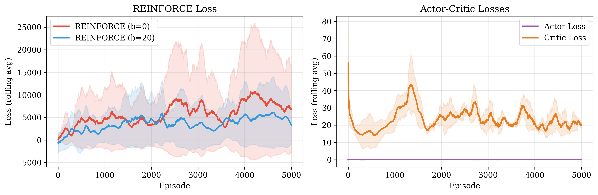<br><sub>Actor and critic losses (Actor-Critic)</sub></td>
<td align="center">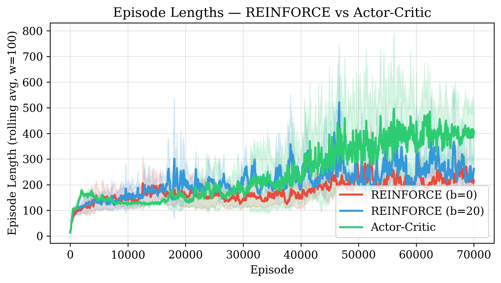<br><sub>Episode length over training</sub></td>
</tr>
<tr>
<td align="center">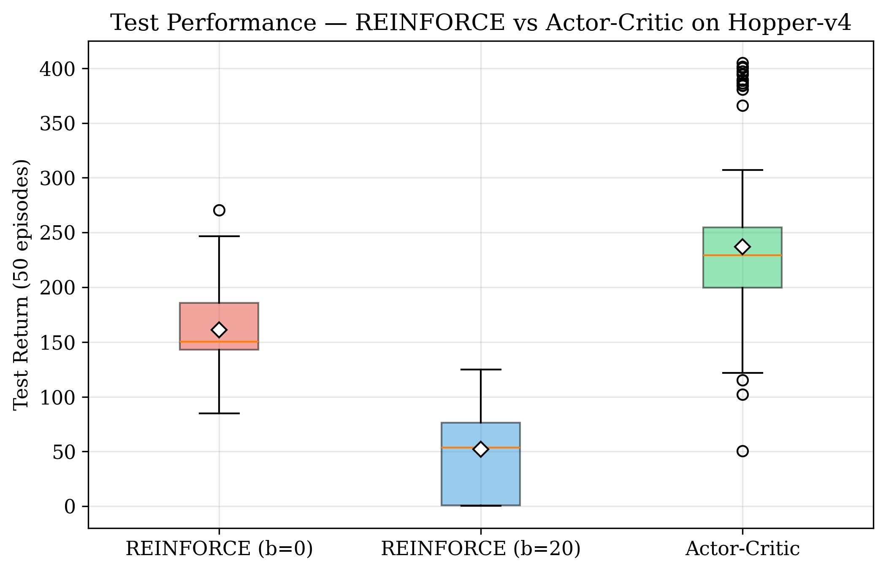<br><sub>Test-return distribution per algorithm</sub></td>
<td align="center">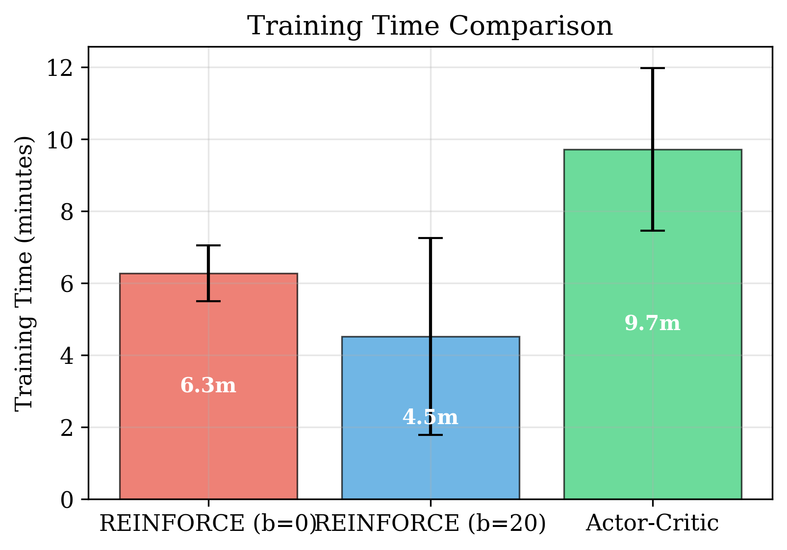<br><sub>Wall-clock training time per algorithm</sub></td>
</tr>
</table>
</details>

<details open>
<summary><b>Part 2 — PandaPush: transfer &amp; mass sensitivity</b></summary>
<br>
<table>
<tr>
<td align="center">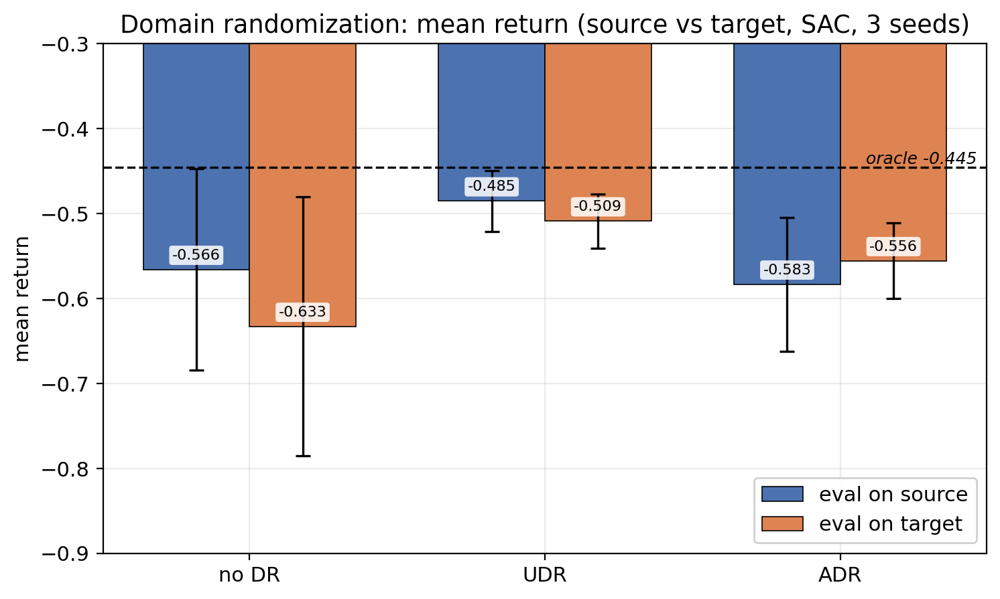<br><sub>Mean return across training strategies</sub></td>
<td align="center">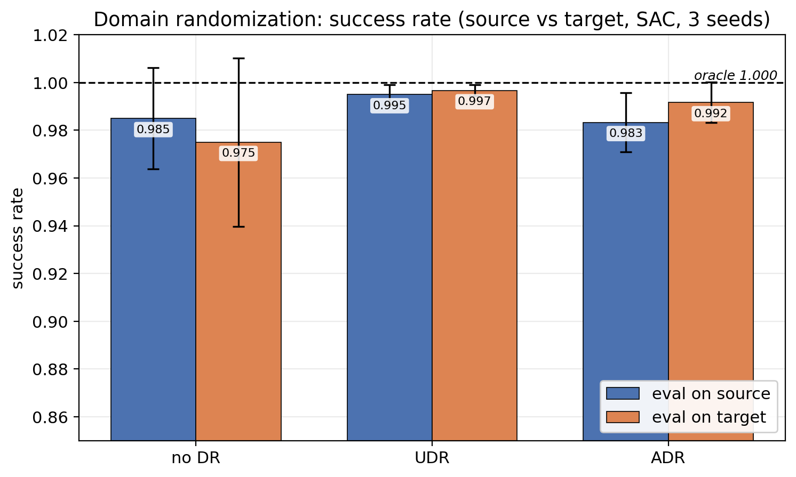<br><sub>Success rate across training strategies</sub></td>
</tr>
<tr>
<td align="center">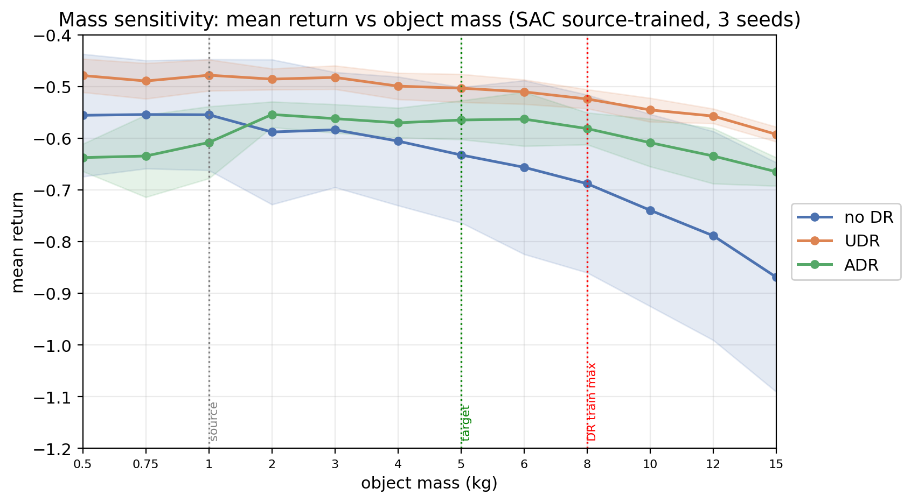<br><sub>Return vs cube mass</sub></td>
<td align="center">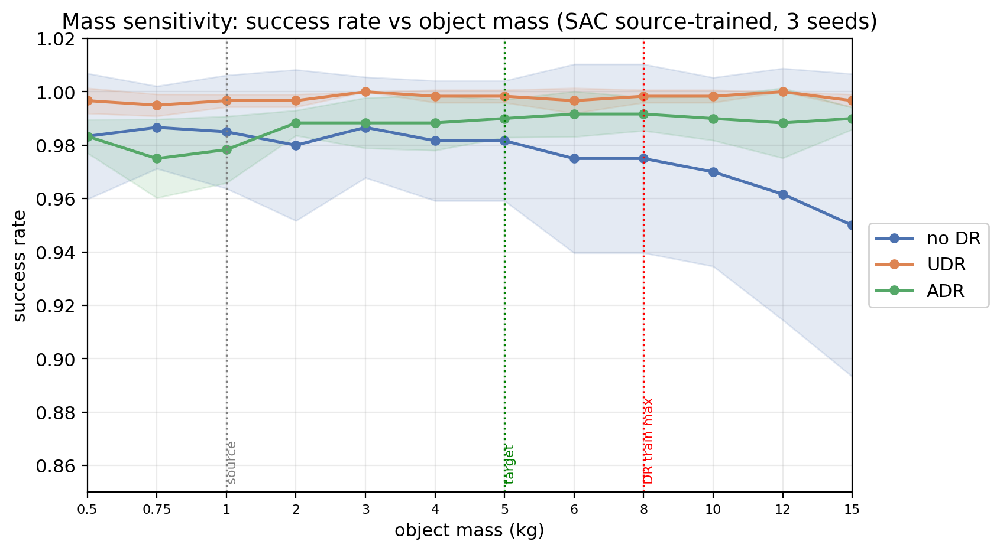<br><sub>Success rate vs cube mass</sub></td>
</tr>
<tr>
<td align="center">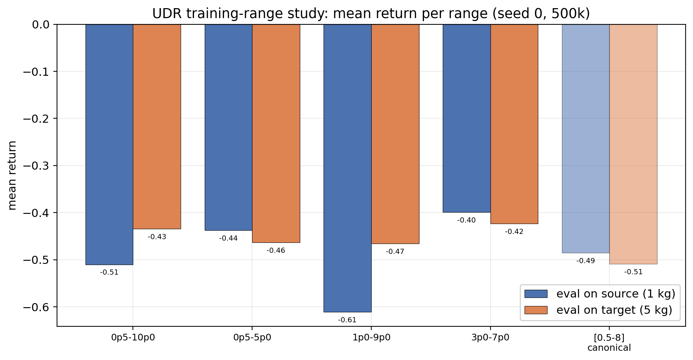<br><sub>Return for different UDR mass ranges</sub></td>
<td align="center">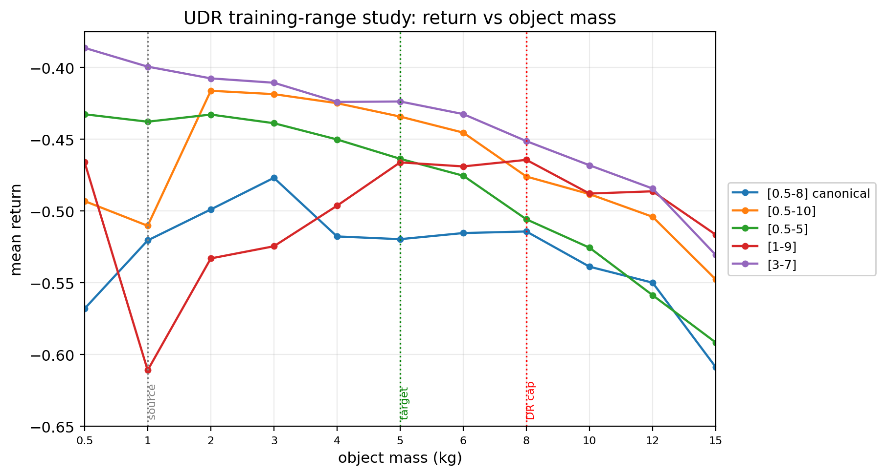<br><sub>Sensitivity to the UDR range</sub></td>
</tr>
</table>
</details>

<details open>
<summary><b>Hyperparameter sweeps (Bayesian &amp; OFAT)</b></summary>
<br>
<table>
<tr>
<td align="center">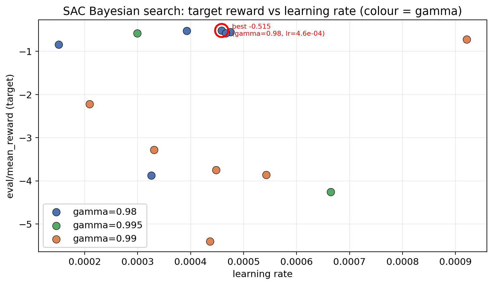<br><sub>Bayesian sweep — return vs learning rate</sub></td>
<td align="center">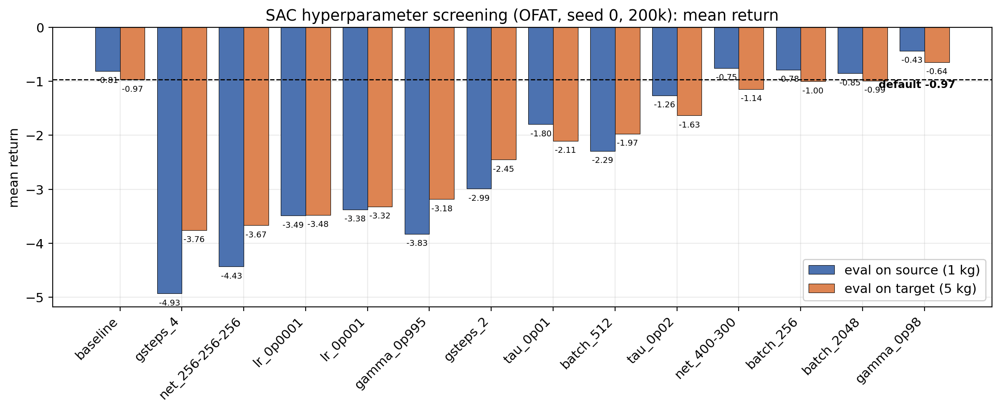<br><sub>OFAT sweep — return per hyperparameter</sub></td>
</tr>
<tr>
<td align="center">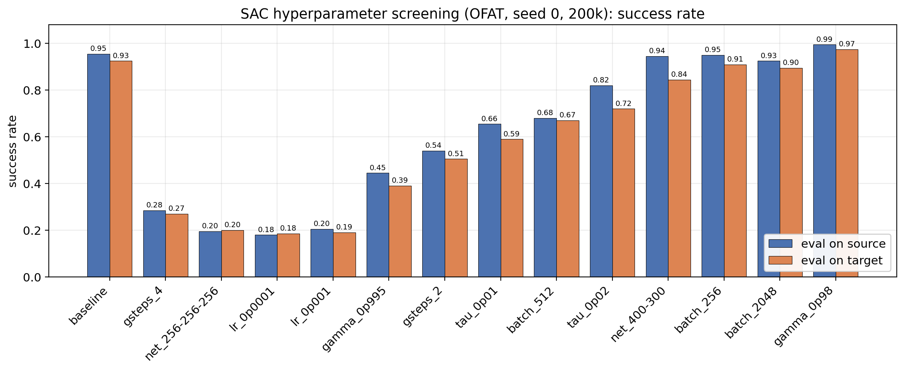<br><sub>OFAT sweep — success rate per hyperparameter</sub></td>
<td align="center">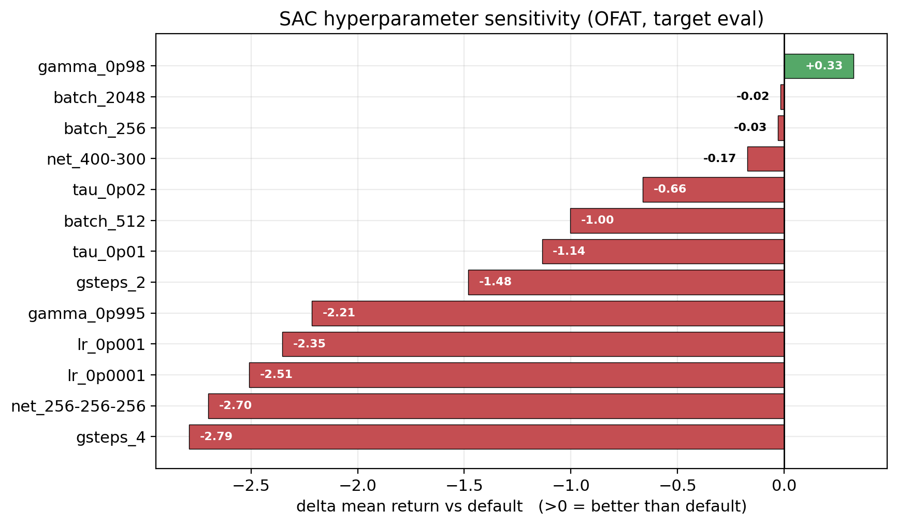<br><sub>OFAT sweep — effect of individual hyperparameters</sub></td>
</tr>
</table>
</details>

## Rendering a rollout

```
# Part 1 — Hopper
cd part1
python render_gif.py --model models_ac_70k_filippo_2026-06-07/policy_ac_70k_filippo_2026-06-07_run_1_best.pth \
    --episodes 3 --out ../assets/hopper.gif

# Part 2 — PandaPush
cd part2
python render_gif.py --model models/sac_target_none_seed2.zip --algo sac \
    --env-type target --episodes 6 --out ../assets/sac_push.gif
```

<sub>Environment renders use <a href="https://github.com/qgallouedec/panda-gym">panda-gym</a>
(MIT © 2020 Quentin Gallouédec) and Gymnasium MuJoCo. Result figures under
<code>part1/figures/</code> and <code>part2/figures/</code> are our own.</sub>
